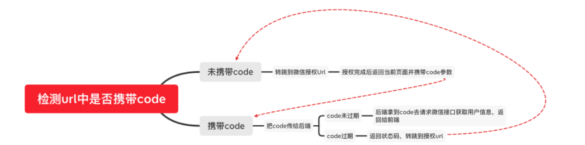

# 微信公众号

> 更多的是注册公众号各种配置麻烦点。注册公众号什么的就不说了。

我之前开发过公众号的网页，开头先讲我在开发过程中的几点。

## 微信授权登录
把项目部署上去后，通过下面的链接去访问。
`https://open.weixin.qq.com/connect/oauth2/authorize?appid=xxx&redirect_uri=xxx`
> `appid`填的是你公众号的，后面的`redirect_uri`通过`encodeURI`编码后重定向访问的地址。

具体可以看官方文档
> https://developers.weixin.qq.com/doc/offiaccount/OA_Web_Apps/Wechat_webpage_authorization.html

这时候返回回来的地址头部会带一个`code`参数，这时候通过`url`拿到`code`。
```js
GetQueryValue(queryName) {
  let query = decodeURI(window.location.search.substring(1))
  let vars = query.split('&')
  for (let i = 0; i < vars.length; i++) {
    let pair = vars[i].split('=')
    if (pair[0] == queryName) {
      return pair[1]
    }
  }
  return null
}
```
拿到`code`后通过后端提过的接口获取`token`等参数。
这里拿到的`token`会有过期的时间，之后进入需要拿旧`token`去后端换新的`token`。
具体返回什么需要换`token`需要看业务了。

这里偷来一张图


## 参考
https://juejin.cn/post/7036922110203133966