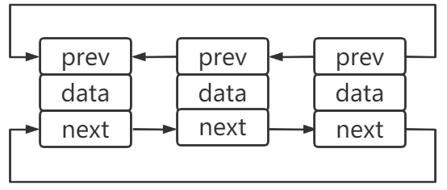

# 数据结构
> 太菜了，学过的课程都忘完了

## 链表
存储线性表的数据，一个对象存储着本身的值和下一个元素的地址
- 查找元素需要遍历，查询慢
- 插入只需要断开连接重修赋值，插入快

### 单向链表
链表存储是不连续，第一个节点称为头节点，通过头节点遍历整个链表，尾节点通常指向null

### 循环链表
> 尾节点指向头节点

### 双向链表
> 两个指针，prev指向前一个节点，next指向后一个节点

### 双向循环链表

随机访问的话，链表做不到。
如果存储的数据元素个数补确定，经常添加删除就比较合适。

## 栈 (stack)
> 后进先出，push和pop都在栈顶

## 队列
> 先进先出。